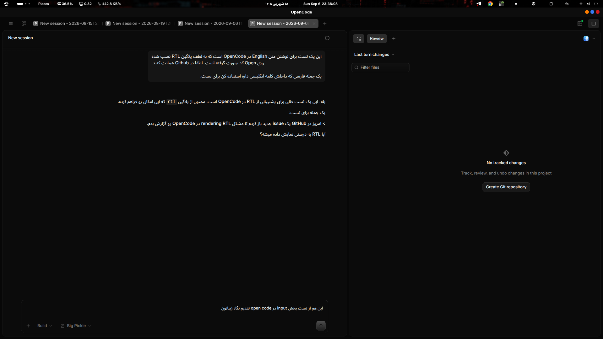

<div dir="rtl" lang="fa" align="center">

# 🇮🇷 OpenCode RTL Fix

**پلاگین‌ِ دوجهته (Bidi/RTL) برای اوپن‌کد** — درست کردن نمایش متن‌های ترکیبی فارسی/عربی/عبری + انگلیسی در ترمینال، دسکتاپ و وب اوپن‌کد

[](LICENSE)
[]()
[](https://github.com/programmer-1998/RTL_OpenCode/actions/workflows/ci.yml)
[](https://www.npmjs.com/package/opencode-rtl-fix)
[](https://github.com/programmer-1998/RTL_OpenCode)

**زبان‌ها:** [🇮🇷 فارسی](README.md) · [🇬🇧 English](README.en.md) · [🇸🇦 العربية](README.ar.md)



</div>

<div dir="rtl">

## 📌 مشکل

وقتی داخل یک جملهٔ فارسی/عربی یک کلمه یا شناسهٔ انگلیسی قرار می‌گیرد — مثل `SINA`، یک نام فایل، یک مسیر یا نام پکیج — رابط اوپن‌کد بدون الگوریتم بیدی **UAX #9** ترتیب کلمات را به هم می‌ریزد:

```
نوشته‌ی شما (ترتیب منطقی):       سلام من SINA هستم
رندر ناقص (بدون حل):             هستم SINA سلام من
رندر درست (خروجیِ صفحه):         هستم SINA من سلام     ← از راست به چپ = «سلام من SINA هستم»
```

این مشکل هم در **ترمینال/TUI**، هم در **اپ دسکتاپ** و هم در **رابط وب** اوپن‌کد وجود دارد و هنگام تایپ پرامپت (کادر ورودی) و نمایش پیام‌ها و پاسخ‌های مدل دیده می‌شود.

## 🧠 راه‌حل — دو لایه

این پروژه مشکل را در **دو لایه‌ی مکمل** حل می‌کند:

| لایه | ابزار | چه چیزی را درست می‌کند |
| --- | --- | --- |
| **۱) لایهٔ متن (سرویس اوپن‌کد)** | پلاگین `server` | پیام‌های ارسال‌شدهٔ کاربر، پیام‌های تاریخی، پاسخ مدل و خروجی ابزارها — با «ایزوله‌های بیدی» (RLI / LRI / PDI) مطابق UAX #9 |
| **۲) لایهٔ رابط (دسکتاپ)** | اسکریپت‌های پچ `patch/` (لینوکس / مک / ویندوز) | **کادر تایپ زندهٔ پرامپت** که پلاگین به آن دسترسی ندارد — با تزریق `dir="auto"` + `unicode-bidi: plaintext` به `app.asar` |

<details>
<summary>🔍 چطور کار می‌کند؟</summary>

- **پلاگین** به هوک‌های سمت سرور اوپن‌کد وصل می‌شود (`chat.message`، `experimental.text.complete`، `tool.execute.after` و…). برای هر پاراگراف، «اولین کاراکتر قوی» جهت را تعیین می‌کند؛ پاراگراف فارسی/عربی را در `RLI…PDI` می‌گذارد و کلمه‌های انگلیسی/کدِ داخلش (مثل `SINA`، `/path/to/file`) را با `LRI…PDI` «منزوی» می‌کند تا ترتیب‌شان قاطی نشود. این کاراکترهای کنترلِ یونیکد **نامرئی** هستند و روی مدل اثری ندارند.
- **پچ دسکتاپ** یک `<style>` و `<script>` به `out/renderer/index.html` داخل `app.asar` اضافه می‌کند تا کرومیومِ اپ، جهت هر پاراگراف را خودکار تشخیص دهد — همان کار «`dir="auto"`» در مرورگرها.

</details>

## ✨ امکانات

- ✅ رندر درست پاراگراف‌های ترکیبی فارسی/عربی/عبری/اردو + انگلیسی
- ✅ ایزوله‌کردن کلمه‌ها و شناسه‌های انگلیسی وسط متن راست‌چین (`SINA`، `API`، مسیرها)
- ✅ حفاظت کامل از **کد** — بلوک‌های سه‌بک‌تیک، کد تورفته و `inline code` دست‌نخورده می‌مانند
- ✅ پیام‌های قبلی (تاریخچهٔ چت) هم هنگام لود تصحیح می‌شوند
- ✅ تشخیص خودکار جهت با قانون «اولین کاراکتر قوی» + امکان اجبار `rtl`/`ltr`
- ✅ راهنمای سیستم به مدل (اختیاری) تا به زبان کاربر پاسخ دهد و کد/مسیرها را LTR نگه دارد
- ✅ ست کردن `OPENCODE_RTL*` در environment ابزارها (اختیاری)
- ✅ دو دستور وضعیت در TUI: `RTL: Show Status` و `RTL: Analyze Sample`
- ✅ پچ دسکتاپ برای هر سه سیستم‌عامل (لینوکس / مک / ویندوز) با بک‌آپ خودکار، تشخیص بومی‌سازی `app.asar.unpacked` و قابلیت بازگشت (`--unpatch`)

## ⚠️ محدودیت مهم (شفاف)

**کادر تایپ پرامپت وقتی هنوز ارسال نکرده‌اید، توسط UI اوپن‌کد رندر می‌شود و هیچ هوک پلاگینی به بافرِ زنده‌ی آن دسترسی ندارد.** برای همین:
- در **اپ دسکتاپ** → این بخش را اسکریپت‌های پچ `patch/` حل می‌کنند — `patch/linux/desktop-rtl.sh`، `patch/macos/desktop-rtl.sh` یا `patch/windows/desktop-rtl.ps1` (لایهٔ ۲).
- در **ترمینال/TUI** → سلول‌به‌سلول توسط `@opentui/core` رندر می‌شود و حل نهایی آن با خود اوپن‌کد است؛ اما به‌محض ارسال، پیام شما و پاسخ مدل با لایهٔ ۱ درست می‌شود.
- به‌محض ارسال، همه‌جا (ترمینال، دسکتاپ، وب) درست است.

---

## 🚀 نصب و فعال‌سازی در اوپن‌کد

پلاگین‌ها را فقط هنگام **استارت اوپن‌کد** بارگذاری می‌کند. بعد از هر تغییر کانفیگ، اوپن‌کد را ببندید و دوباره باز کنید.

### روش ۱ — از npm (بعد از انتشار)

```jsonc
// ~/.config/opencode/opencode.jsonc  (جهانی)
// یا  opencode.jsonc  در ریشهٔ پروژه (محلی)
{
  "$schema": "https://opencode.ai/config.json",
  "plugin": [
    [
      "opencode-rtl-fix",
      { "language": "auto" }
    ]
  ]
}
```

### روش ۲ — از سورس / پوشهٔ محلی

```sh
git clone git@github.com:programmer-1998/RTL_OpenCode.git
cd RTL_OpenCode
npm ci && npm run build
```

سپس آدرس پوشه (یا فایل `dist/server.js`) را در کانفیگ بدهید:

```jsonc
{
  "$schema": "https://opencode.ai/config.json",
  "plugin": [
    [
      "/home/<user>/RTL_OpenCode",
      { "language": "auto", "isolateToolOutput": "off" }
    ]
  ]
}
```

> 💡 به‌جای مسیر مطلق می‌توانید `./RTL_OpenCode` (نسبت به پوشهٔ کانفیگ) یا `file:///...` بدهید؛ هر سه فرمت معتبر است.

### روش ۳ — خودکار در پروژه (`auto-detect`)

پلاگین را داخل یکی از پوشه‌های زیرِ خودِ پروژه قرار دهید تا اوپن‌کد بدون کانفیگ پیدایش کند:

```
.opencode/plugin/rtl/package.json
.opencode/plugin/rtl/dist/…
```

> 💡 لایهٔ ۱ (پلاگین سمت سرور که با جاوااسکریپت نوشته شده) روی **لینوکس، مک و ویندوز کاملاً یکسان** کار می‌کند. فقط پچ دسکتاپ (لایهٔ ۲) برای هر سیستم‌عامل فایل جداگانه دارد — پایین را ببینید.

---

## ⚙️ آپشن‌های پلاگین

| آپشن | پیش‌فرض | توضیح |
| --- | --- | --- |
| `enabled` | `true` | روشن/خاموش کل پلاگین |
| `language` | `"auto"` | `auto` یا `none` یا `fa` / `ar` / `he` / `ur` (اجبار زبان) |
| `systemGuidance` | `true` | افزودن راهنمای RTL به سیستم‌پرامپت (یا متن دلخواه) |
| `isolateUserMessages` | `"auto"` | `off` / `auto` / `always` — ایزوله‌کردن پیام کاربر |
| `isolateAssistantText` | `"auto"` | ایزوله‌کردن پاسخ مدل |
| `isolateToolOutput` | `"off"` | ایزوله‌کردن خروجی ابزارها (اگر کپی/پیست دقیق مهم است خاموش بماند) |
| `minRtlRatio` | `0.2` | حداقل نسبت کاراکتر RTL برای تشخیص خودکار |
| `minRtlCharacters` | `2` | حداقل تعداد کاراکتر RTL |
| `digitMode` | `"preserve"` | تبدیل ارقام: `preserve` / `latin` / `arabic-indic` / `eastern-arabic` |
| `forceDirection` | `"auto"` | اجبار جهت ایزوله: `auto` / `rtl` / `ltr` |
| `alignRtlParagraphs` | `false` | راست‌چین بصری در ترمینال با padding **(مقدار خام متن را هم عوض می‌کند؛ فقط TUI)** |
| `rtlWrapColumn` | `96` | ستون شکستن سطر برای alignment |
| `rtlAlignColumn` | `96` | ستون راست‌چینی |
| `directionEnv` | `true` | ست کردن `OPENCODE_RTL*` در environment ابزارها |
| `debug` | `false` | لاگ از طریق `client.app.log()` |

> **نکتهٔ جهت:** جهت بر اساس «اولین کاراکتر قوی» است؛ جمله‌ای که با فارسی شروع شود RTL و جمله‌ای که با انگلیسی/کد شروع شود LTR در نظر گرفته می‌شود. برای اجبار همه‌چیز به راست‌چین: `"forceDirection": "rtl"`.

---

## 🖥️ پچ اپ دسکتاپ (برای کادر تایپ)

اپ دسکتاپ (Electron) متن را بدون جهت‌دهیِ خودکار رندر می‌کند. پچ یک `<style>` + `<script>` به `out/renderer/index.html` داخل `app.asar` اضافه می‌کند تا کادر تایپ و پیام‌ها دقیقاً مثل مرورگرهای مدرن عمل کنند.

پچ از یک **موتور مشترک جاوااسکریپت** استفاده می‌کند (`patch/lib/patch-asar.mjs`) که روی هر سه سیستم‌عامل یکسان کار می‌کند؛ فقط «بسته‌بند» (wrapper) مخصوص هر سیستم‌عامل، مسیر اپ را پیدا و دسترسی لازم (sudo / UAC) را می‌گیرد:

| سیستم‌عامل | فایل نصب | پیش‌نیاز |
| --- | --- | --- |
| 🐧 لینوکس | `patch/linux/desktop-rtl.sh` | node 20+ و sudo |
| 🍎 مک | `patch/macos/desktop-rtl.sh` | node 20+ و sudo |
| 🪟 ویندوز | `patch/windows/desktop-rtl.ps1` | node 20+ |

### نصب روی لینوکس

```sh
sudo bash patch/linux/desktop-rtl.sh
```

### نصب روی مک

```sh
sudo bash patch/macos/desktop-rtl.sh
```

> 💡 اگر بعد از پچ، اپ بالا نیامد (امضای کد شکسته شده)، دوباره امضا کنید:
> `sudo codesign --force --deep --sign - "/Applications/OpenCode.app"`

### نصب روی ویندوز

PowerShell را باز کنید و اجرا کنید:

```powershell
powershell -ExecutionPolicy Bypass -File patch\windows\desktop-rtl.ps1
```

با پنجرهٔ UAC موافقت کنید. (یا مستقیماً روی `patch\windows\desktop-rtl.cmd` دوبار کلیک کنید.)

### این کار چه می‌کند؟

1. یک بک‌آپ از `app.asar` در همان‌جا (`app.asar.bak-rtl`) می‌سازد؛
2. `app.asar` را باز می‌کند، `index.html` را پچ می‌کند، دوباره می‌بندد؛
3. چیدمان `app.asar.unpacked` (ماژول‌های native مانند `node-pty`) را **یکی‌به‌یکی با نسخهٔ قبلی مقایسه و تأیید می‌کند** تا چیزی نشکند.

سپس **اوپن‌کد دسکتاپ را ببندید و دوباره باز کنید**.

### بازگشت (Revert)

```sh
# لینوکس / مک
sudo bash patch/linux/desktop-rtl.sh --unpatch
sudo bash patch/macos/desktop-rtl.sh --unpatch
```

```powershell
# ویندوز
powershell -ExecutionPolicy Bypass -File patch\windows\desktop-rtl.ps1 -Unpatch
```

### ⚠️ بعد از هر آپدیت دسکتاپ

اپ از خودکار-آپدیت استفاده می‌کند و آپدیت، فایل پچ‌شده را جایگزین می‌کند. بعد از هر آپدیت فقط کافی است اسکریپت سیستم‌عامل خودتان را دوباره اجرا کنید.

> مسیر پیش‌فرض: لینوکس `/opt/OpenCode/resources/app.asar`، مک `/Applications/OpenCode.app/Contents/Resources/app.asar`، ویندوز `%LOCALAPPDATA%\Programs\OpenCode\resources\app.asar`. اگر جای دیگری نصب است: لینوکس/مک `sudo DESKTOP_ASAR=/path/to/app.asar bash patch/linux (یا macos)/desktop-rtl.sh`، ویندوز `powershell ... -Asar C:\path\to\app.asar`.

---

## 🧪 تست در اوپن‌کد (گام‌به‌گام)

1. اوپن‌کد را ببندید و دوباره باز کنید (تا پلاگین لود شود).
2. در **دسکتاپ**، این متن را در کادر تایپ بنویسید — باید طبیعی از راست به چپ و با `SINA` وسطش درست دیده شود:

   ```
   سلام من SINA هستم
   ```

3. یک پرامپت ترکیبی با مسیر/کد بفرستید، مثلاً:

   ```
   محتوای فایل src/config.ts را بخوان و لیست بده
   ```

   و بررسی کنید ترتیب `src/config.ts` و جملهٔ فارسی جابه‌جا نشده است.
4. در **ترمینال**، اگر دستور `RTL: Show Status` را دارید اجرا کنید تا وضعیت پلاگین را ببینید:

   ```
   /rtl.status
   ```

5. تست‌های خودکار:

   ```sh
   cd RTL_OpenCode && npm test
   ```

---

## 🛠️ توسعه

```sh
npm ci
npm run build      # tsc → dist/
npm run typecheck  # بررسی تایپ‌ها
npm test           # build + تست‌های 15گانه (شامل موتور پچ دسکتاپ)
```

## 📂 ساختار

```
RTL_OpenCode/
├── src/
│   ├── core.ts      ← موتور بیدی: تشخیص جهت، ایزوله، مارک‌داون/کد، alignment
│   ├── server.ts    ← هوک‌های سمت سرور (Plugin)
│   ├── tui.ts       ← دستورهای TUI (RTL: Show Status / Analyze Sample)
│   └── index.ts     ← خروجی‌ها
├── test/core.test.js   ← تست‌ها
├── patch/
│   ├── lib/patch-asar.mjs      ← موتور مشترک پچ (جاوااسکریپت، همهٔ سیستم‌عامل‌ها)
│   ├── linux/desktop-rtl.sh    ← پچ اپ دسکتاپ لینوکس
│   ├── macos/desktop-rtl.sh    ← پچ اپ دسکتاپ مک
│   └── windows/
│       ├── desktop-rtl.ps1     ← پچ اپ دسکتاپ ویندوز
│       └── desktop-rtl.cmd     ← اجرای دوبار-کلیک ویندوز
├── examples/opencode.json ← نمونه کانفیگ کامل
└── dist/             ← خروجی بیلد (کامیت‌شده)
```

## 🤖 CI و انتشار (GitHub Actions)

- **`.github/workflows/ci.yml`** — روی push/PR: نصب، typecheck، build، تست در Node 20/22/24 + کنترل هم‌گام‌بودن `dist` با سورس + تست و چک نحوی اسکریپت‌های پچ‌های هر سه سیستم‌عامل.
- **`.github/workflows/release.yml`** — با پوشِ تگِ `v*`:
  - یک **Release** در گیت‌هاب با باندل (zip) + `npm pack` (.tgz) می‌سازد؛
  - اگر سکرت `NPM_TOKEN` تنظیم شده باشد، خودکار در **npm** هم منتشر می‌شود (`opencode-rtl-fix`).

  ساخت نسخه:

  ```sh
  git tag v0.1.0 && git push origin v0.1.0
  ```

---

## 🙏 اعتبارات (Credits)

- **opencode** — [github.com/anomalyco/opencode](https://github.com/anomalyco/opencode) · [opencode.ai](https://opencode.ai)
- پلاگین مرجع **opencode-rtl** روی npm (نویسنده: `razavioo`) که الهام‌بخش این پیاده‌سازی بود
- مراجع و کارهای مرتبط در مونوریپؤ opencode:
  - [issue #35319](https://github.com/anomalyco/opencode/issues/35319) — متن ترکیبی خراب در دسکتاپ
  - [issue #32984](https://github.com/anomalyco/opencode/issues/32984) — رندر RTL در رابط‌ها
  - [issue #40286](https://github.com/anomalyco/opencode/issues/40286) — RTL/بیدی TUI
  - [PR #25455](https://github.com/anomalyco/opencode/pull/25455) — `dir="auto"` برای وب

## 📄 مجوز

[MIT](LICENSE) © sina khanzadeh

</div>